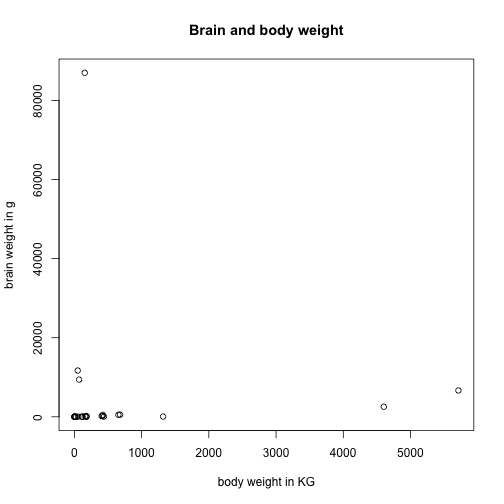
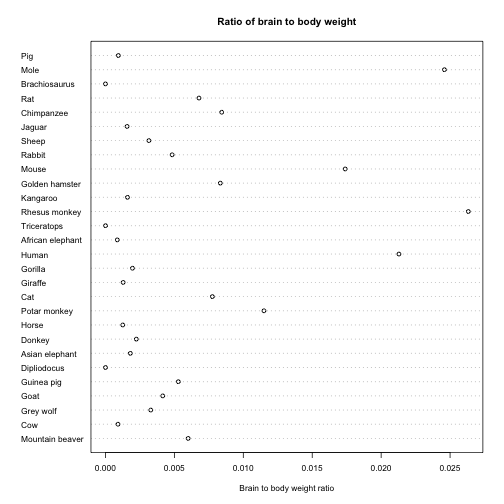

Phase1Presentation
========================================================
author: Austin Pray and Joe Bao
date: 2017-02-19
autosize: true

First Slide
========================================================

For more details on authoring R presentations please visit <https://support.rstudio.com/hc/en-us/articles/200486468>.

- Bullet 1
- Bullet 2
- Bullet 3

Brain and Body weight for animals
========================================================

- Data gathered from P. J. Rousseeuw and A. M. Leroy (1987) Robust Regression and Outlier Detection. Wiley, p. 57.

- The dataset comes from average brain and body weights for 28 species of land animals.

- body: body weight in kg.

- brain: brain weight in g.


Summary
========================================================


```
      body              brain        
 Min.   :    0.02   Min.   :   0.40  
 1st Qu.:    3.10   1st Qu.:  22.23  
 Median :   53.83   Median : 137.00  
 Mean   : 4278.44   Mean   : 574.52  
 3rd Qu.:  479.00   3rd Qu.: 420.00  
 Max.   :87000.00   Max.   :5712.00  
```

Head
========================================================


```
# A tibble: 6 × 2
      body brain
     <dbl> <dbl>
1     1.35   8.1
2   465.00 423.0
3    36.33 119.5
4    27.66 115.0
5     1.04   5.5
6 11700.00  50.0
```

Tail
========================================================

```
# A tibble: 6 × 2
       body brain
      <dbl> <dbl>
1   100.000 157.0
2    52.160 440.0
3     0.280   1.9
4 87000.000 154.5
5     0.122   3.0
6   192.000 180.0
```

Correlation
========================================================

```
              body        brain
body   1.000000000 -0.005341163
brain -0.005341163  1.000000000
```

Brain and Body weight scatterplot
========================================================



Brain and Body ratio dot plot
========================================================


What we seek to learn
========================================================
- We should be able to combine this data with other data on animal reproduction and determine if brain/body weight ratio has anything to do with animal reproduction and the average number of offpsring an animal will have in a lifetime.

Slide With Code
========================================================


```r
summary(cars)
```

```
     speed           dist       
 Min.   : 4.0   Min.   :  2.00  
 1st Qu.:12.0   1st Qu.: 26.00  
 Median :15.0   Median : 36.00  
 Mean   :15.4   Mean   : 42.98  
 3rd Qu.:19.0   3rd Qu.: 56.00  
 Max.   :25.0   Max.   :120.00  
```

Slide With Plot
========================================================


