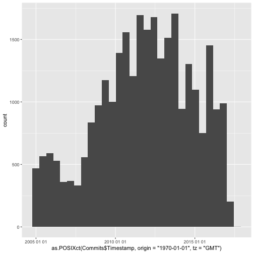

Term Project Datasets
========================================================
author: Austin Pray and Joe Bao
date: 2017-02-19
autosize: true

Our Datasets
========================================================

- Ruby on Rails Commit History
- UTD 2017 Coursebook
- Brain and Body Weight for Animals

Ruby on Rails Commit History
========================================================

This dataset is a full set of the git commits that make up the Ruby on Rails web framework.

```
git clone git@github.com:rails/rails.git
git log --date=iso --pretty=format:"%h%x09%an%x09%ad%x09%s" > rails-commits.iso.tsv.txt
```

Ruby on Rails Commit History Columns
========================================================

- SHA: git commit sha
- author: git commit author
- timestamp: UTC timestamp of the commit
- commit message: text that came with the commit

Ruby on Rails Commit History Preview
========================================================


```r
library(parsedate)

Commits = read.table(
  "./data/rails-commits.iso.tsv.txt",
  sep="\t",
  header=FALSE,
  fill=TRUE,
  col.names=c("SHA", "Author", "Timestamp", "Commit_Message"),
  colClasses = c("Timestamp"="character"))

Commits$Timestamp <- sapply(Commits$Timestamp, parse_date)
```

Ruby on Rails Commit History Preview Cont.
========================================================


```r
head(Commits)
```

```
         SHA         Author  Timestamp
1 53ff5fc62f yuuji.yaginuma 1487414211
2 c059caab7b       Jon Moss 1487356691
3 5abe7018f4  Akira Matsuda 1487405336
4 fc9a2dc14c        Richard 1487332249
5 33860b3556 Ryuta Kamizono 1487373061
6 46bf9eea53      Yves Senn 1487325257
                                                                        Commit_Message
1 Remove deprecate passing string to `:if` and `:unless` conditional options [ci skip]
2                                                                  Merge pull request 
3                                                                  Merge pull request 
4                                 Change engines guide to demonstrate maintained forum
5                                 Remove `:doc:` for `NumericalityValidator` [ci skip]
6                                                                  Merge pull request 
```

Ruby on Rails Commit History Preview Cont.
========================================================


```r
library(ggplot2)
base <- qplot(as.POSIXct(Commits$Timestamp, origin = "1970-01-01", tz = "GMT"))
base + scale_x_datetime(date_labels = "%Y %m %d")
```



UTD Coursebook
========================================================

UT Dallas coursebook as downloadable from coursebook.utdallas.edu

Important columns:

- Instructor: instructor name
- Enrollment: amount of students enrolled for the class
- Class Name: class's full name
- Department: department that offers the class

UTD Coursebook
========================================================


```r
library(readr)

coursebook = read.csv("data/utd-coursebook.csv")

summary(coursebook)
```

```
             class.id    course.prefix  course.number     section    
 acct2301.001.17s:   1   math   : 243   3310   :  77   001    :1164  
 acct2301.002.17s:   1   cs     : 213   2125   :  61   501    : 460  
 acct2301.003.17s:   1   biol   : 146   2414   :  57   002    : 316  
 acct2301.004.17s:   1   atec   : 117   1302   :  55   003    : 166  
 acct2301.005.17s:   1   ce     : 117   3300   :  48   0w1    : 106  
 acct2301.501.17s:   1   acct   : 114   1311   :  45   004    :  90  
 (Other)         :3384   (Other):2440   (Other):3047   (Other):1088  
  term       call.number   
 17s:3390   Min.   :20006  
            1st Qu.:22617  
            Median :24798  
            Mean   :24554  
            3rd Qu.:26564  
            Max.   :28450  
                           
                                             class.title  
 Integral Calculus                                 :  57  
 Rhetoric                                          :  41  
 Physics Laboratory I                              :  40  
 Survey of Oral and Technology-based Communication :  38  
 Computer Science I                                :  31  
 General Chemistry Laboratory II                   :  30  
 (Other)                                           :3153  
                       class.subtitle    status             instructors  
                              :3147   Closed: 798   Kuei Sun      :  41  
 Collegium V Honors           :  27   Open  :2592                 :  26  
 Honors                       :  10                 Paul Macalevey:  23  
 Recitation                   :   8                 Jeanne Pitz   :  21  
 Laboratory                   :   6                 Won Namgoong  :  18  
 ANAT & PHYS OF SPCH & HEARING:   3                 Diana Cogan   :  17  
 (Other)                      : 189                 (Other)       :3244  
                                                                                                                                                                           schedule   
 -schedule is not posted or not applicable-                                                                                                                                    : 256  
 Fri : 1:00pm-3:45pm : ECSN_3.112;Fri : 1:00pm-3:45pm : ECSN_3.112;Fri : 1:00pm-3:45pm : ECSN_3.112;Fri : 1:00pm-3:45pm : ECSN_3.112;Fri : 1:00pm-3:45pm : ECSN_3.112          :   6  
 Thurs : 1:00pm-3:45pm : ECSN_3.112;Thurs : 1:00pm-3:45pm : ECSN_3.112;Thurs : 1:00pm-3:45pm : ECSN_3.112;Thurs : 1:00pm-3:45pm : ECSN_3.112;Thurs : 1:00pm-3:45pm : ECSN_3.112:   6  
 Tues : 1:00pm-3:45pm : GR_4.204                                                                                                                                               :   5  
 Wed : 12:00pm-1:00pm : SSB_3.107B;Wed : 12:00pm-1:00pm : SSB_3.107B;Wed : 12:00pm-1:00pm : SSB_3.107B;Wed : 12:00pm-1:00pm : SSB_3.107B                                       :   5  
 Fri : 7:00pm-9:45pm : SOM_2.717                                                                                                                                               :   4  
 (Other)                                                                                                                                                                       :3108  
   enrollment       max.enroll       core.area     sess     
 Min.   :  0.00   Min.   :-40.00          :2899   1  :3342  
 1st Qu.: 11.00   1st Qu.:  1.00   020 090: 140   8w1:  15  
 Median : 23.00   Median :  7.00   030 090:  86   8w2:  31  
 Mean   : 31.34   Mean   : 15.42   010    :  67   bmn:   1  
 3rd Qu.: 40.00   3rd Qu.: 23.00   090    :  55   cmn:   1  
 Max.   :939.00   Max.   :275.00   010 090:  38             
                                   (Other): 105             
      ues         ues.          ues..1             col           dept     
 -      : 356   Mode:logical   Mode:logical   ecs    :850   mgmt   : 755  
 do_eval:3034   NA's:3390      NA's:3390      mgt    :755   ah     : 352  
                                              nsm    :697   csci   : 324  
                                              ah     :352   elec   : 271  
                                              bbs    :237   math   : 271  
                                              eps    :200   bbsc   : 237  
                                              (Other):299   (Other):1180  
      act       sess.1           insts        asst.count     
 lec    :2468   1  :3342   kxs147030:  41   Min.   : 0.0000  
 lab    : 334   8w1:  15            :  26   1st Qu.: 0.0000  
 stu    : 139   8w2:  31   paulmac  :  23   Median : 0.0000  
 lbr    : 136   bmn:   1   jxp133430:  21   Mean   : 0.5909  
 pra    :  71   cmn:   1   wxn062000:  18   3rd Qu.: 1.0000  
 ind    :  59              dcc095020:  17   Max.   :23.0000  
 (Other): 183              (Other)  :3244                    
                                      textbooks    syllabus  
                                           :1614      : 886  
 9781305616691,9781305597624,9781285858265 :  94   syl:2504  
 9781259741111                             :  41             
 9781285338231,9781285922966,9781285858265 :  41             
 9780205770212                             :  38             
 9781133712183,9781133106524               :  26             
 (Other)                                   :1536             
```

UTD Coursebook
========================================================


```r
topProfs = sort(table(coursebook$instructors), decreasing = T)
dotchart(head(topProfs, 20))
```


Brain and Body weight for animals
========================================================

- Data gathered from P. J. Rousseeuw and A. M. Leroy (1987) Robust Regression and Outlier Detection. Wiley, p. 57.

- The dataset comes from average brain and body weights for 28 species of land animals.

- body: body weight in kg.

- brain: brain weight in g.


Brain and Body weight for animals
========================================================


```r
dotchart(ratiobabw$new,labels=row.names(ratiobabw),cex=.7,
  	main="Ratio of brain to body weight", 
   xlab="Brain to body weight ratio")
```


